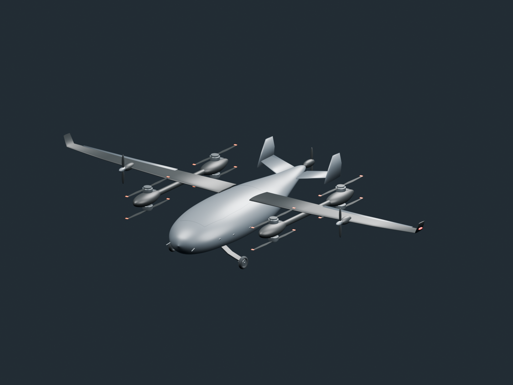

# SkyCaptain · EV50 / SkyTrans 交互飞行机库

[](https://github.com/HaifengYue/sky-captain/actions/workflows/ci.yml)
[](https://github.com/HaifengYue/sky-captain/actions/workflows/integration-browser.yml)

**在一个场景里观察两种飞行器，从机体细节到完整飞行演示。**

SkyCaptain（空中机长）是由 Blender、TypeScript 和 Three.js 构成的交互视景机库。EV50 与 SkyTrans 共用一个原生 Three.js 画布、渲染器、产品舞台和动态地形。项目面向视觉研究、机构观察和本机外部控制开发，提供可编辑模型、确定性回放与可测试的控制接口。

[打开公开机库](https://haifengyue.github.io/sky-captain/) · [直接观察 SkyTrans](https://haifengyue.github.io/sky-captain/?aircraft=skytrans) · [使用指南](docs/USER_GUIDE.md) · [统一控制 API](docs/UNIFIED_CONTROL.md) · [品牌与兼容迁移](docs/BRAND-MIGRATION.md)

> SkyTrans 是本项目的模型名称，原整合版本称为 Transwing。它是依据公开参考资料制作的非官方视觉重建，不是厂家改名、官方数字模型、飞控、工程 CAD 或经过认证的物理仿真器。参考机型的公开规格与本项目的演示配置分别标注。

## 机库里有什么

| 能力       | EV50                                            | SkyTrans                                                  |
| ---------- | ----------------------------------------------- | --------------------------------------------------------- |
| 机体与机构 | 复合翼机体、8 个垂起旋翼 + 3 个巡航推进单元     | 连续整翼转换、四电机折桨、六片独立舵面、货舱盖            |
| 飞行演示   | 原有 180 秒任务与航线                           | 共享水平航线与地形，独立 316 秒演示时间表                 |
| 观察方式   | 自由观察、地面、侧面、跟随、远景、机鼻/下视相机 | 自由观察、正面、侧面、俯视、左右关节、跟随、机鼻/下视相机 |
| 外部数据   | EV50 API、MAVLink 风格状态、PX4 ULog 转换后回放 | 本机 Python 桥、独立电机/舵面、JSON 记录回放              |
| 统一接口   | `hangar.control.v1`，浏览器与本机 HTTP          | 同一接口、同一控制租约与生命周期                          |

- 顶部机库支持切换与直达链接：`?aircraft=ev50`、`?aircraft=skytrans`，并处理浏览器前进/后退。
- 产品模式默认自由观察。明确进入“飞行演示”会自动播放并跟随；重复点击不会重置当前时间。
- 机构操作保留观察机位，只有明确选择检查视角才重新取景。
- 截图、视频输出、独立相机和回放均服从当前机型生命周期。切换机型会清理播放、输入、外控连接、异步导入及专属资源；未完成的输出会取消。

### 模型预览

下图是仓库内 EV50 模型的固定视角预览。SkyTrans 的交互机构、飞行阶段和实时画面可在上方公开机库中查看。



更多固定视角见 [previews/aircraft](previews/aircraft/)。这些图是视觉预览，不是尺寸检验或硬件性能报告。

## 本地启动

需要 **Node.js 24**。从仓库根目录执行：

```sh
npm ci
npm ci --prefix threejs
npm --prefix threejs run dev
```

打开终端打印的地址即可。普通机库、机构操作和 JSON 回放不依赖 Python 或 Blender。

构建静态页面：

```sh
npm --prefix threejs run build
npm --prefix threejs run preview
```

构建采用相对资源路径，可部署在 GitHub Pages 仓库子路径下。构建时从规范资产生成旧资源 URL 的兼容副本，不在源目录维护第二套模型。

## SkyTrans 飞行演示

SkyTrans 使用 **316 秒**的视觉演示 profile。180 m 的垂直段按上升峰值 **3 m/s**、下降峰值 **2 m/s**展开，起步与制动各有 4 秒平滑过渡。HUD 的轨迹速度和带符号垂直速度来自位置对仿真时间的导数；播放倍率只改变相对于墙钟的播放快慢。

电机转速随启动、起飞、悬停、巡航和下降阶段平滑变化。后桨在巡航前减速、寻位和折叠，回转前展开并恢复转速；落地后留出 6 秒完整停机。暂停保持相位，拖动时间轴立即恢复对应时刻的状态；0.1× 慢放便于观察叶片，高速采用历史相位快门扫掠；巡航扫掠层使用有界对比度和柔和边缘提高可辨性，不改变转速、相位、折桨或停机时序。

配置入口：[`demoProfile.ts`](threejs/src/aircraft/skytrans/demoProfile.ts)。这些数值不是厂家性能、实测 RPM 或飞控限制。EV50 的 180 秒任务、外部控制时钟与 JSON 回放时钟保持原有契约。

## 山地、城镇与渐隐航迹

飞行视景使用蓝天与程序化白云。右侧“飞行场景”可选择 **山区 · 绿色山谷** 或 **海岛 · 蔚蓝海岸**，两机型共用场景。海岛包含独立岛屿、浅海、沙岸与树群；山区保留河湖、城镇与道路。切换只重建自有景观资源并清空旧视觉航迹，不改变飞机、当前仿真时间、播放状态、视角或外控租约。

新浏览器默认山区。选择保存在当前站点本地；也可使用 `?landscape=mountains` 或 `?landscape=islands` 直达，合法 URL 值优先于保存偏好，非法值回退到合法偏好或山区。浏览器禁用存储时仍能使用。产品模式仍是模型摄影棚，选中的蓝天景观在飞行模式显示。

山区景观包含深浅绿色草坡、成片林地、连贯山地、河道与湖泊、河岸、连接道路和村镇。树群通过固定种子分布、不同冠幅与绿阶形成层次。地形高度场、城镇落地与水面共同约束场景；Low / Medium / High 使用分级网格和实例化物体控制负载，不靠无限增加几何堆出细节。

两机型飞行时都可显示白色渐隐航迹。色带读取实际世界坐标与当前仿真时间，暂停时冻结，随飞行推进变宽、变淡并消散；时间轴跳转、重启、切机、数据源/控制权切换和瞬移会断开旧带。航迹使用固定容量缓冲，通过原有“航迹”开关控制。连续采样间隔超过 0.6 个仿真秒时保守断开，避免把稀疏外部状态连成长条。

航迹采用更清晰的白色核心和柔边，近段半宽从 0.6 米起，按绝对年龄扩散；Low / Medium / High 的最长视觉寿命分别为 14 / 20 / 24 个仿真秒，仍使用最多 384 点的固定缓冲。寿命不是保证所有旧轨迹都在镜头内，暂停也不会继续按墙钟消散。

白色带是风格化的飞行路径提示，不是对电动无人机必然产生凝结尾迹的物理断言。质量预算和渲染资源统计也不是实机 GPU 性能基准。景观不是控制碰撞地图：外控位姿及旧 EV50 手动命令的既有包络保持，不会为新山地偷偷抬高目标；低空外控可能穿入可见地形。

绿色山地与增强白带的已发布版本保留在 [archive/green-landscape-20261009](https://github.com/HaifengYue/sky-captain/tree/archive/green-landscape-20261009)，用于回溯本次蓝天及多场景更新之前的状态。

## 统一外部控制

浏览器入口为 `window.hangarAPI.request`。需要从本机 Python 或其他程序接入时，先构建再启动 loopback 服务：

```sh
npm --prefix threejs run build
npm --prefix threejs run control:hangar
```

打开它打印的唯一地址，默认是 `http://127.0.0.1:8790/?control=local`。公开静态机库不会自动连接或探测本机服务。

接入顺序：

1. 查询能力与 `aircraft.state`，读取机型、`generation` 和 `commandEpoch`。
2. 以当前机型和版本取得唯一控制租约。
3. 同一 owner/lease 下发送命令；外部时钟用 `clock.step` 显式推进。
4. 模型在实际渲染后返回应用 ACK。机型切换、断开、过期或新 epoch 会使旧命令失效。

场景位置单位为米，右手坐标，+Y 向上，姿态采用 XYZW 四元数。机体坐标约定按机型能力返回。服务只绑定 loopback，没有公网控制入口或远程认证系统；租约用于协调页面客户端，不是安全认证凭据。

详细操作、原子校验、去重、超时与 Python 标准库示例见 [统一控制文档](docs/UNIFIED_CONTROL.md)。

### SkyTrans Python SDK 与 JSON

SkyTrans 专属 SDK 的规范导入名为 `skytrans_sim`：

```sh
python3 models/skytrans/python/run_server.py
# 另一个终端运行示例；Windows 的 PYTHONPATH 设置方式见文档。
PYTHONPATH=models/skytrans/python python3 models/skytrans/examples/python/full_flow.py
```

先构建前端，再打开 Python 服务打印的 `http://127.0.0.1:8765/?aircraft=skytrans`，选择“连接本机 Python 桥”。该服务保留原 `/api/v1` 与 **`transwing.sim.v1` wire 协议**；新 `skytrans_sim` 和旧 `transwing_sim` 使用同一实现和控制权，协议字符串不因品牌名改变。示例生成的 JSON 也继续使用这个兼容协议。

网页的“播放公开 Python 示例”只读取打包的 JSON，不执行 Python。导入记录最大 1 MiB，最多 10,000 条命令，校验失败不会部分接管模型。见 [Python 接入](models/skytrans/PYTHON.md) 与 [兼容映射](docs/BRAND-MIGRATION.md)。

## 模型、目录与重建

```text
blender/                         EV50 模型导出入口
models/ev50.blend、ev50.glb       EV50 源工程与模型
models/skytrans/                 SkyTrans 源资产、SDK、机械契约与验证工具
  assets/blender/xp4.blend       原生完整机体，保留内部资产 ID
  python/skytrans_sim/           规范 Python SDK
threejs/src/aircraft/            EV50/SkyTrans 适配器与机库生命周期
threejs/src/control/             统一控制契约、租约、校验和 ACK
threejs/public/skytrans/         SkyTrans 运行时模型与示例
threejs/e2e/                     Chromium 真实页面回归
scripts/replay_log.py            EV50 ULog 检查与转换
previews/                        固定视角预览
docs/                            接口、使用、迁移与历史验证说明
```

SkyTrans 的 GLB、Blend、动画 clip 和内部机械证据保持原字节/标识；品牌迁移不重新烘焙或改变几何。`xp4` 是保留的内部资产变体 ID。哈希与来源见 [PROVENANCE](models/skytrans/PROVENANCE.md)，重建工具及适用范围见 [REBUILD](models/skytrans/REBUILD.md)。

EV50 导出示例：`blender -b --python blender/export_aircraft.py`。Blender 不在 PATH 时使用本机可执行文件的完整路径。

ULog 转换示例（原始 `.ulg` 保持本地，默认不进入 Git）：

```sh
python scripts/replay_log.py models/SITL_optimal.ulg --inspect
python scripts/replay_log.py models/SITL_optimal.ulg threejs/public/flight-replay.json
```

转换器读取位置、姿态和执行器主题，最多输出 12,000 帧，仅对整条轨迹施加固定视觉原点平移。执行器归一化值对应视觉转速，不代表实测 RPM。

## 测试与验证

```sh
npm run ci
npm --prefix threejs run test:browser
# 可选原生模型管线 preflight，先安装其锁定工具依赖：
npm ci --prefix models/skytrans/scripts --ignore-scripts
npm --prefix models/skytrans run check
```

- `npm run ci` 覆盖格式、TypeScript/构建、EV50 API、机库/统一控制、模型、飞行、SkyTrans 核心和 Python 协议/HTTP 测试。
- Chromium 用例检查真实 WebGL、机型切换、机构、相机、演示速率、转子时序、外控 ACK 和品牌兼容入口。
- 原生模型 preflight 检查哈希、路径、语法和管线依赖；完整 Blender rebake 与有限物理采样是单独工作流，不等于浏览器测试，也没有因本次品牌迁移重新完成。
- [历史集成验证记录](docs/INTEGRATION-VERIFICATION.md)保留当时的名称和结果，不能用旧报告冒充当前提交的新验收。

更多开发约定见 [CONTRIBUTING](CONTRIBUTING.md)，视觉证据范围与软件渲染 CI 预算见 [VISUAL-VALIDATION](docs/VISUAL-VALIDATION.md)。

## 来源与限制

- SkyTrans 依据 Pterodynamics Transwing P4 的公开照片、视频和资料进行非官方视觉重建。内部传动、行程、转角、转速和停止/折桨时序含理想化约定。
- 页面引用的参考机型 41 kg、6.8 kg、31 m/s、70 min 来自[厂商 2025 年公开资料](https://pterodynamics.com/media/PD_TranswingSpecs_2025.pdf)，不能作为 SkyTrans 的实机性能或模型计算结果。
- 本项目不证明连续无碰撞、制造可行性、结构强度、飞行安全或适航性。渲染资源计数也不等于物理显存用量或硬件性能基准。
- 第三方许可见 [THIRD_PARTY_NOTICES](models/skytrans/THIRD_PARTY_NOTICES.txt)。仓库未提供适用于整个工程的统一许可证；这些 notices 不授予原作者之外的额外素材权利。

[EV50 API](docs/API.md) · [EV50 本机 HTTP](docs/HTTP_CONTROL.md) · [MAVLink 风格状态](docs/MAVLINK_LOCAL.md) · [集成说明](docs/INTEGRATION.md)
